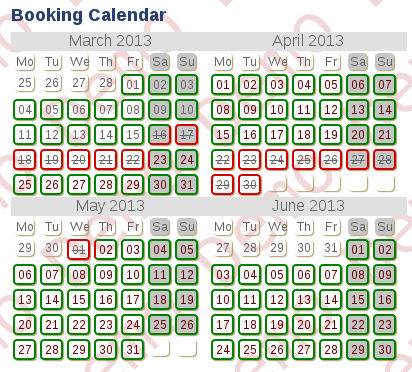
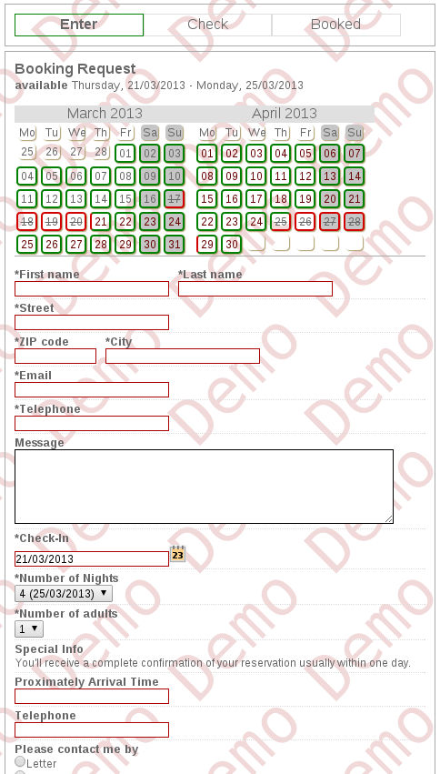
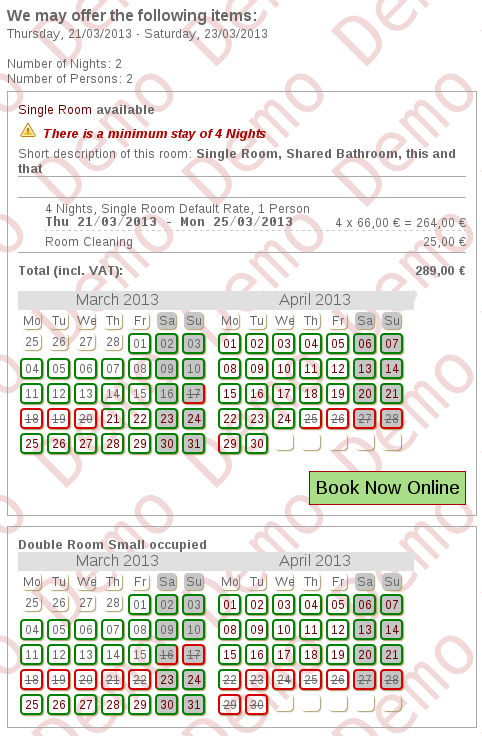

.. ==================================================
.. FOR YOUR INFORMATION
.. --------------------------------------------------
.. -*- coding: utf-8 -*- with BOM.

.. include:: ../Includes.txt

Introduction
============

What does it do?
----------------

This extension provides a very basic booking tool and may be used e.g. 
as flat booking system for a small set of rooms. It should be easily 
adapted to rent other things on a per day basis.

There is a calendar view showing the vacancies of a given room. The 
visitor may select a vacant day and will receive a booking form. After 
sending this form, the booking is saved to the database and the booked 
days are blocked immediately.

Another approach, which can be used e.g. on the front-page, is an 
availability check form. After selecting a date and a period, the visitor
receives a list of all offers - vacant or booked. The vacant offers may
be selected and the booking form is shown again.

The extension may be used as simple vacancies calendar without this 
booking feature. This is possible but not the intetion of the author.

What does it NOT?
-----------------

**There is no possible to handle categories!**

If you have 10 rooms (6 double rooms and 4 single rooms) you need to 
enter 10 different "products" which may be booked separately. 

**There is no backend module!**

You have to use the list module to add and/or edit bookings in the 
backend. To enter bookings, the best way is currently to use the frontend
as your visitors do.

**There is no connection to tt_address to save the custom data or 
formhandler to handle the booking form.**

**There is no dynamic calculation** of the booking rate inside the booking
form (e.g. with jQuery).

One or more of these features may come later and/or with a rewritten 
version of this extension. Please make suggestions what you need first.
**Best is, to add a feature request on** forge_.

.. _forge: http://forge.typo3.org/projects/extension-ab\_booking/

Screenshots
-----------

In the following some screenshot examples of the important views. All 
examples are taken from the demo page `ab_booking.bigga.de`_. On this 
page you see some use cases. You may also login into the backend where
you can see the plugin configuration (except Typoscript Templates).

.. _`ab_booking.bigga.de`: http://ab_booking.bigga.de/en/

	Example of vacancies calendar with 2 rows and 2 columns

	The booking form which can be defined via Typoscript

	The list of all offers after sending the availability check
