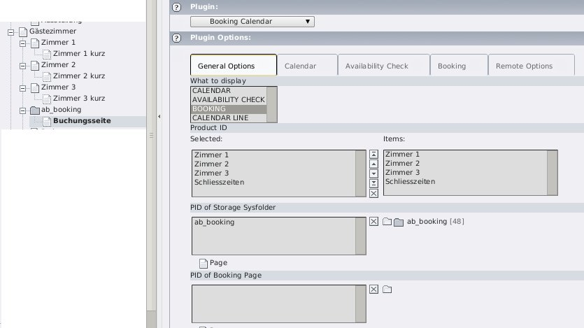

.. ==================================================
.. FOR YOUR INFORMATION
.. --------------------------------------------------
.. -*- coding: utf-8 -*- with BOM.

.. include:: ../Includes.txt

Users manual
------------

Documentation of how to use the extension, how it works, how to apply it, if it's a website plugin.

Language should be non-technical, explaining, using small examples. Don't use to many acronyms unless they have been explained.

Examples: For the "News" plugin this would be a manual showing how to create the news items, explaining the options etc.

Provide screenshots of a neutral Backend such as the Backend of the Introduction Package for instance. Have in mind that the User manual could possibly be re-used in a larger documentation compilation, for example when a company generates a documentation for its client.

Target group: **Users**

	Backend Plugin Configuration

FAQ
^^^

Possible subsection: FAQ
